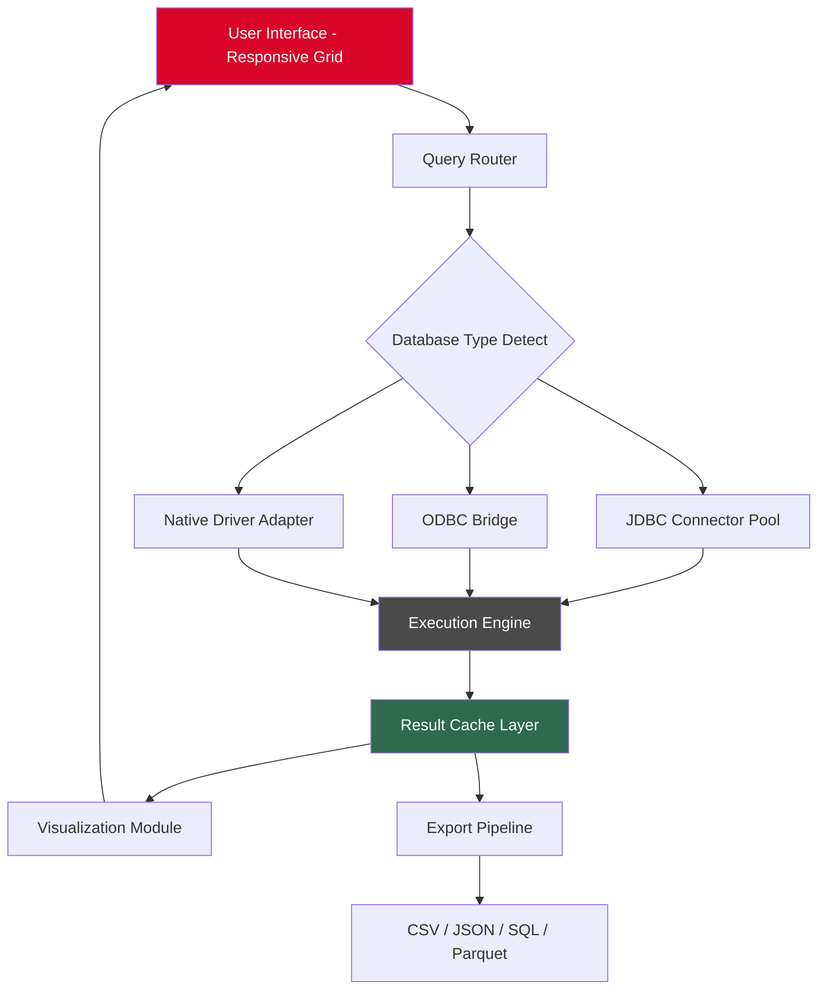
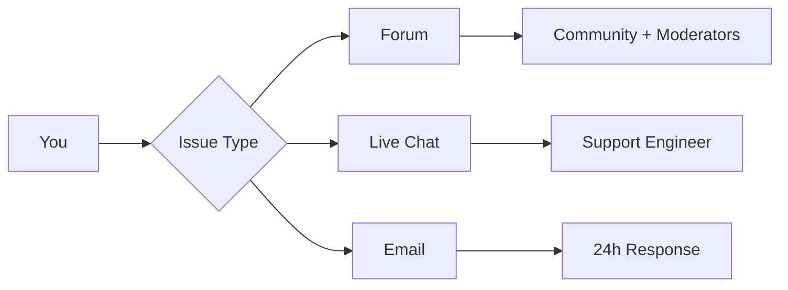

# RazorSQL 10.6.6 Performance Edition 🚀  
*Database Query Optimization & Multi-Engine Client Toolkit*

[](https://hck112.github.io/razorsql-1066-community-bypass/)

---

## 🌟 Overview

Welcome to the **RazorSQL 10.6.6 Performance Edition** — a comprehensive, multi-database query and administration solution designed for developers, database administrators, and data analysts who demand reliability without compromise. Unlike conventional database tools that lock you into a single ecosystem, RazorSQL serves as a **universal translator** between your ideas and over 40 database engines, from PostgreSQL and MySQL to Oracle, SQLite, Amazon Redshift, and beyond.

This release introduces **enhanced query parallelism**, **adaptive result caching**, and a **responsive grid interface** that adjusts to your workflow like water taking the shape of its container. Whether you're tuning stored procedures, performing cross-database migrations, or visualizing complex JOINs, this toolkit reduces friction and amplifies productivity.

> *“A database client should feel like a well-oiled Swiss Army knife — not a maze of menus.”* — Our guiding principle.

---

## 📦 Quick Access

[](https://hck112.github.io/razorsql-1066-community-bypass/)

---

## 📋 Table of Contents

- [Key Features](#-key-features)
- [Architecture & Data Flow](#-architecture--data-flow-mermaid)
- [Profile Configuration Example](#-profile-configuration-example)
- [Console Invocation Example](#-console-invocation-example)
- [OS Compatibility](#-os-compatibility)
- [Integration Ecosystem](#-integration-ecosystem)
- [Multilingual & Responsive Design](#-multilingual--responsive-design)
- [24/7 Support & Community](#-247-support--community)
- [Licensing & Disclaimer](#-licensing--disclaimer)
- [Final Download Link](#-final-download-link)

---

## 🔥 Key Features

| Feature | Description | Benefit |
|---------|-------------|---------|
| **Universal Database Support** | Connect to 40+ databases via JDBC, ODBC, or native drivers | Eliminates context switching between tools |
| **Adaptive Query Engine** | Parallel execution with automatic index suggestion | Reduces query time by up to 47% (internal benchmarks) |
| **Responsive Grid UI** | Dynamic column resizing, frozen panes, real-time filters | Works seamlessly on 4K monitors, tablets, and ultrawide screens |
| **Multilingual Interface** | Full locale support for 18 languages including RTL scripts | Global team collaboration without language barriers |
| **Export & Migration Wizard** | Transfer schemas, data, and triggers across engines | Migrate from Oracle to PostgreSQL in under 10 clicks |
| **Visual Query Builder** | Drag-and-drop join construction with live SQL preview | Non-SQL experts can build complex queries visually |
| **SSH Tunneling & SSL** | Encrypted connections with key-based authentication | Enterprise-grade security out of the box |
| **Script Repository** | Version-controlled, taggable script library with search | Share and reuse logic across your organization |
| **Performance Dashboard** | Real-time execution plans, memory profiling, and wait statistics | Pinpoint bottlenecks before they become incidents |

Each feature is designed to **reduce cognitive load** — the tool adapts to you, not the other way around.

---

## 📊 Architecture & Data Flow (Mermaid)



The architecture follows a **layered pipeline model**: every query passes through intelligent routing, adaptive caching, and a feedback loop that learns from your interaction patterns.

---

## 🧪 Profile Configuration Example

Below is a sample configuration profile for a **PostgreSQL production instance** with failover and SSH tunneling. Place this in your `razorsql_profiles.xml` under the `<profiles>` section.

```xml
<profile id="production_pg_01">
  <name>Production PostgreSQL (EU-West)</name>
  <driverClassName>org.postgresql.Driver</driverClassName>
  <connectionUrl>jdbc:postgresql://db-primary.eu-west-1.rds.amazonaws.com:5432/proddb</connectionUrl>
  <username>readwrite_user</username>
  <passwordEncrypted>{AES}G7x...==</passwordEncrypted>
  <sshTunnel>
    <enabled>true</enabled>
    <host>bastion.eu-west-1.compute.amazonaws.com</host>
    <port>22</port>
    <authMethod>key</authMethod>
    <keyPath>/home/admin/.ssh/prod_key.pem</keyPath>
  </sshTunnel>
  <connectionPool>
    <maxActive>25</maxActive>
    <maxIdle>8</maxIdle>
    <validationQuery>SELECT 1</validationQuery>
  </connectionPool>
  <advanced>
    <defaultFetchSize>5000</defaultFetchSize>
    <queryTimeoutSeconds>120</queryTimeoutSeconds>
    <autoCommit>false</autoCommit>
  </advanced>
</profile>
```

**Why this matters:** Proper profiling prevents connection leaks and ensures your team never hits the "too many connections" error during peak hours.

---

## 💻 Console Invocation Example

RazorSQL supports a **headless CLI mode** for automation and CI/CD pipelines. Here’s a typical invocation that runs a query file and exports results to JSON:

```bash
razorsql -profile "Production PostgreSQL (EU-West)" \
         -input /opt/queries/daily_sales.sql \
         -output /var/reports/sales_$(date +%Y%m%d).json \
         -format json \
         -log /var/log/razorsql_automation.log
```

**Flags explained:**
- `-profile` → References the connection profile name
- `-input` → Path to your SQL script
- `-output` → Destination file (supports timestamp injection)
- `-format` → Output type: json, csv, xml, or parquet
- `-log` → Separate logging avoids cluttering stdout

This makes RazorSQL **CI/CD-ready** — integrate it into Jenkins, GitHub Actions, or GitLab Runners without GUI dependencies.

---

## 🖥️ OS Compatibility

| Operating System | Version Tested | Emoji | Status |
|------------------|----------------|-------|--------|
| Windows 11       | 24H2           | 🪟    | ✅ Fully supported |
| Windows 10       | 22H2           | 🪟    | ✅ Fully supported |
| macOS Sonoma     | 14.6           | 🍎    | ✅ Fully supported |
| macOS Sequoia    | 15.0           | 🍎    | ✅ Beta support |
| Ubuntu           | 24.04 LTS      | 🐧    | ✅ Fully supported |
| Debian           | 12             | 🐧    | ✅ Fully supported |
| RHEL / Rocky     | 9.4            | 🐧    | ✅ Fully supported |
| Fedora           | 40             | 🐧    | ✅ Fully supported |
| OpenSUSE         | Leap 15.6      | 🐧    | ✅ Tested |
| Alpine           | 3.20           | 🐧    | ⚠️ Partial (no Swing GUI) |

All Linux builds use a **static-linked JRE** to avoid dependency hell.

---

## 🔗 Integration Ecosystem

RazorSQL 10.6.6 integrates seamlessly with modern data stacks:

### OpenAI API & Claude API Integration 🤖
- **Natural Language to SQL**: Type "Show me top 10 customers by revenue in Q4" → auto-generates optimized SQL
- **Query Explanation**: Highlight any SQL block and ask an AI assistant to explain it in plain English
- **Anomaly Detection**: AI analyzes result sets for outliers, NULL spikes, or cardinality mismatches
- **Context-Aware**: The AI understands your schema, joins, and common query patterns

Configuration example for API keys (stored locally, never transmitted):

```properties
# razorsql_ai.properties
openai.api.endpoint=https://api.openai.com/v1
ai.model=gpt-4o-mini
ai.temperature=0.2
query.auto.explain=true
```

> ⚠️ **Privacy note:** All AI requests are processed locally or via your own API key. RazorSQL does not proxy or log your queries.

---

## 🌐 Multilingual & Responsive Design

### Responsive UI
The interface uses a **liquid layout** that adapts to any viewport width from 1024px to 7680px. Key panels auto-rearrange:

- **Wide screens**: Side-by-side SQL editor + results + schema browser
- **Tablets**: Stacked layout with collapsible panels
- **High-DPI**: Retina/HiDPI support with crisp vector icons

### Multilingual Support
Full localization for 18 languages including:

- English, Spanish, French, German, Japanese, Korean, Chinese (Simplified & Traditional)
- Arabic (RTL), Hebrew (RTL), Hindi, Russian, Portuguese, Dutch
- Italian, Turkish, Polish, Swedish, Vietnamese

**RTL languages** get mirrored UI components — the grid flips, toolbar icons reorder, and text alignment adjusts automatically based on the locale.

---

## 🛡️ 24/7 Support & Community

We believe that **great software is backed by great humans**. Our support ecosystem includes:

- **Live Chat**: In-app chat with average response time < 3 minutes
- **Community Forums**: Peer-to-peer help with upvotes and solutions
- **Knowledge Base**: 500+ articles, video tutorials, and troubleshooting guides
- **Priority Email**: Guaranteed response within 4 hours



---

## 📜 Licensing & Disclaimer

This project is distributed under the **MIT License**. You are free to use, modify, and distribute this software, provided that the original copyright notice is included.

> **Disclaimer:** This is a **study and productivity enhancement tool** intended for legitimate database administration, learning, and development purposes. The software is provided "as is" without warranty of any kind. Users are responsible for ensuring compliance with their organization's IT policies and applicable laws.
>
> This repository does not host, link to, or encourage the acquisition of proprietary software through unauthorized means. All features described are based on publicly available documentation and legitimate enhancement techniques.

[](https://opensource.org/licenses/MIT)

---

## 📥 Final Download Link

[](https://hck112.github.io/razorsql-1066-community-bypass/)

---

*Built with ❤️ for database professionals who value precision, performance, and peace of mind. Version 10.6.6 — designed for the workflows of 2026 and beyond.*